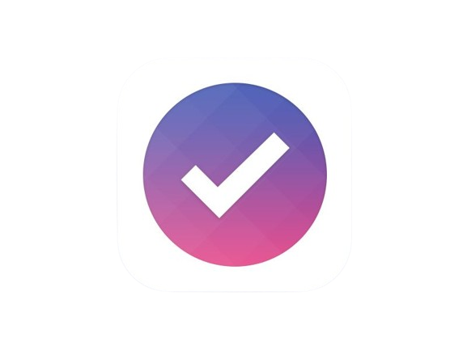
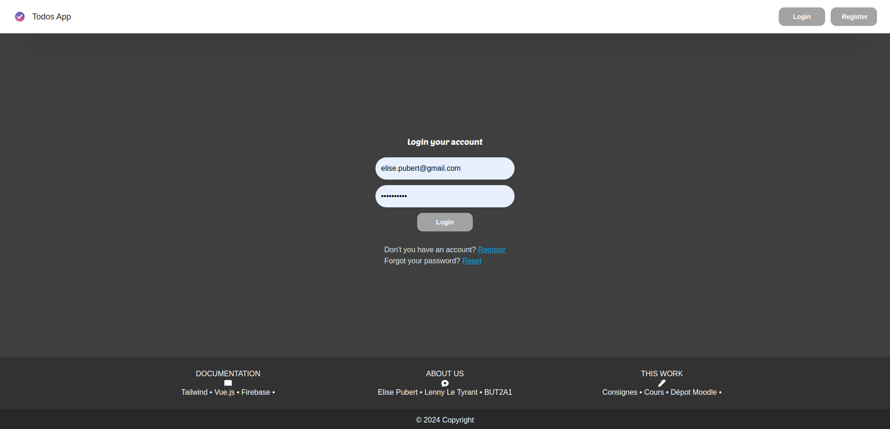
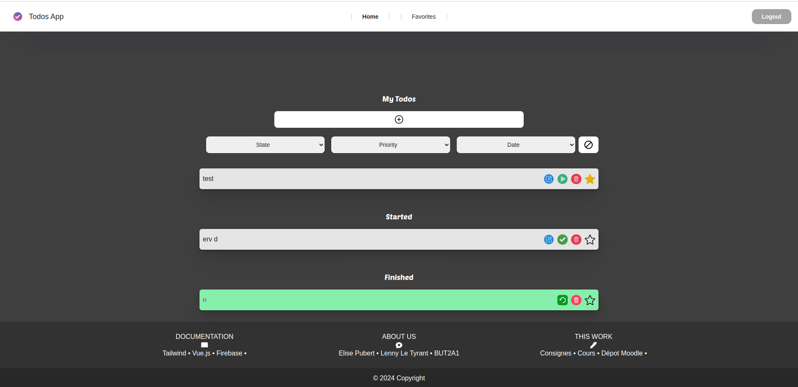
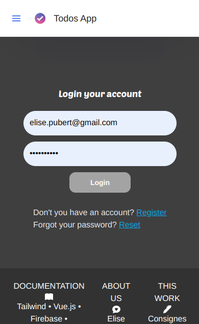
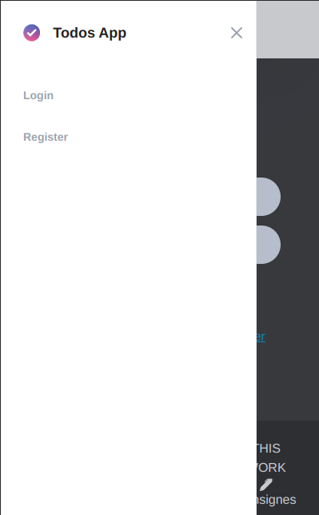
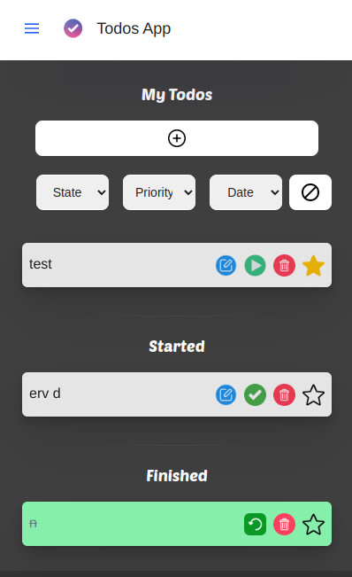
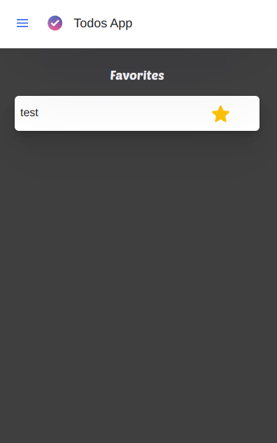

# Todos Application
<!-- PROJECT LOGO -->
<br />
<div id="readme-top" align="center">
  <a href="">
    
  </a>

  <h3 align="center">ToDos App</h3>

  <p align="center">
    ● PUBERT ELISE ●
    <br />
    <br />
    <a href="https://firebase.google.com/">Firebase</a>
    ·
    <a href="https://fr.vuejs.org/">Vuejs</a>
    ·
    <a href="https://tailwindcss.com/">Tailwindcss</a>
    
  </p>
</div>

<div align="center">
<i>Ce README contient du HTML, notamment pour les images et les icônes. Il est donc préférable de le consulter sur un support adapté.<i>
</div>


<br/>

<!-- TABLE OF CONTENTS -->
<details>
  <summary>Table des matières</summary>
  <ol>
    <li>
      <a href="#about-the-project">About The Project</a>
      <ul>
        <li><a href="#features">Features</a></li>
        <li><a href="#built-with">Built With</a></li>
      </ul>
    </li>
    <li>
      <a href="#installation">Installation</a>
      <ul>
        <li><a href="#setup-de-votre-IDE">SetUp IDE</a></li>
        <li><a href="#Setup-De-Votre-IDE">Dépendances</a></li>
      </ul>
    </li>
    <li><a href="#usage">Usage</a></li>
  </ol>
</details>


<!-- ABOUT THE PROJECT -->
## About The Project

Ce projet utilise le cadriciel Vue.js. Il est également adapté au format mobile. 

Cette application permet de :
* Créer un compte utilisateur
* Se connecter en tant qu'utilisateur
* Voir la liste des todos crées, commencés et terminés
* Filter les todos en fonction de leur état, de leur priorité, de leur date de début et de fin
* Voir la liste des todos favoris

### Features
* Les données sont stockées en ligne sur firebase. Le système d'authentification permet de savoir si un utilisateur est connecté et si oui, lequel. 
*  Un système de favoris a été rajouté, permettant à l'utilisateur d'avoir une liste de todos favoris
* Si l'utilisateur a oublié son mot de passe, il peut le réintialiser. Un lien lui sera envoyé.

### Built With

Documentations des frameworks et outils utilisés.

* [![Vue][Vue.js]][Vue-url]
* [![Tailwind][tailwind.io]][tailwind-url]
* [![Firebase][firebase.io]][firebase-url]
* [![JS][js]][js-url]
* [![HTML][html]][html-url]
* [![CSS][css]][css-url]

<!-- INSTALLATION -->
## Installation

### Setup De l'IDE (recommandé)

[VSCode](https://code.visualstudio.com/) + [Volar](https://marketplace.visualstudio.com/items?itemName=Vue.volar) (and disable Vetur) + [TypeScript Vue Plugin (Volar)](https://marketplace.visualstudio.com/items?itemName=Vue.vscode-typescript-vue-plugin).

### Installation Des Dépendances
```sh
npm install
```

#### Compiler et hot reload pour le développement

```sh
npm run dev
```

#### Pour compiler et réduire pour la production

```sh
npm run build
```

Se rendre sur ``http://localhost:5173/``


<!-- USAGE -->
## USAGE
#### exemple d'utilisation
1. Créez un nouveau compte à partir de la page d'inscription
2. Une fois connecté, vous pouvez utiliser le bouton + pour ajouter des tâches.
3. Cliquez sur le bouton + puis écrivez votre tâche en remplissant les champs correctement, appuyez sur le bouton Ajouter.
4. Pour modifier vos tâches, cliquez sur le bouton d'édition en bleu, puis écrivez votre nouvelle tâche, et enfin appuyez sur la touche "Entrée".
5. Vous pouvez egalemment supprimer, ajouter aux favoris et valider la tâche pour qu'elle passe à l'étape suivante (par exemple marquer une tâche comme "démarrée" changera son statut).
6. Essayez de filtrer les todos en modifiant les filtres.
7. Cliquez sur l'onglet "favoris" pour accéder aux todos favoris.
8. Déconnectez-vous en cliquant sur "Logout"

>*NBs : <br> > Si vous oubliez votre mot de passe, vous pouvez réinitialiser votre mot de passe à partir de la page de réinitialisation. <br> > Lorsque l'application est en version mobile, les onglets apparaissent dans le menu à gauche*

- vues depuis un PC : 

<div align="center">
  
  
</div>

- vues depuis téléphone mobile : 
<div align="center" class="bg-blue-500">
  
  
  
  
</div>

<br />

<p align="right">(<a href="#readme-top">back to top</a>)</p>


<!-- MARKDOWN LINKS & IMAGES -->
<!-- https://www.markdownguide.org/basic-syntax/#reference-style-links -->

[Vue.js]: https://img.shields.io/badge/Vue.js-35495E?style=for-the-badge&logo=vuedotjs&logoColor=4FC08D
[Vue-url]: https://vuejs.org/
[tailwind.io]: https://img.shields.io/badge/tailwindcss-0F172A?&logo=tailwindcss
[tailwind-url]: https://tailwindcss.com/
[firebase.io]: https://img.shields.io/badge/firebase-ffca28?style=for-the-badge&logo=firebase&logoColor=black
[firebase-url]: https://firebase.google.com/
[html]: https://img.shields.io/badge/HTML-239120?style=for-the-badge&logo=html5&logoColor=white
[html-url]: https://www.w3schools.com/html/default.asp
[css]: https://img.shields.io/badge/CSS-239120?&style=for-the-badge&logo=css3&logoColor=white
[css-url]: https://www.w3schools.com/css/default.asp
[js]: https://shields.io/badge/JavaScript-F7DF1E?logo=JavaScript&logoColor=000&style=flat-square
[js-url]: https://www.javascript.com/


